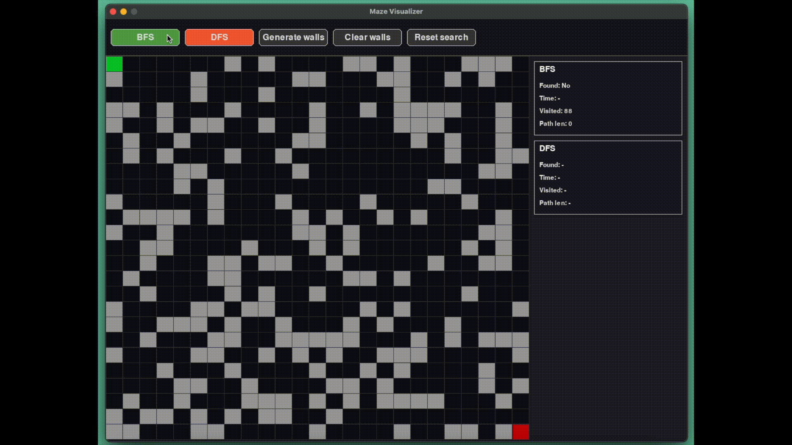

# BFS / DFS Maze Solver

An interactive maze visualizer written in Python and Pygame.  
You can draw walls, generate random mazes, and see how **Breadth-First Search (BFS)** and **Depth-First Search (DFS)** explore the grid and find a path from a start cell to an end cell.



---

## What are BFS and DFS?

### Breadth-First Search (BFS)

BFS is a graph search algorithm that explores nodes **level by level**.

In a grid:

- It starts from the start cell.
- It first visits all cells at distance 1, then distance 2, and so on.
- With uniform edge cost, BFS always finds a **shortest path in terms of number of steps** (if one exists).

### Depth-First Search (DFS)

DFS explores a graph by always going **as deep as possible** along a path before backtracking.

In a grid:

- It chooses one direction and keeps going until it hits a dead-end.
- Then it backtracks and tries alternative paths.
- DFS does not guarantee the shortest path, but it is simple and useful to understand different exploration strategies.

This project lets you visually compare BFS and DFS on the same maze: how they explore, how many cells they visit, and how long their paths are.

---

## Features

- Interactive grid-based maze.
- Set walls by clicking or dragging with the mouse.
- Generate random walls with one click.
- Visualize:
  - BFS exploration,
  - DFS exploration.
- Live statistics panels:
  - whether a path was found,
  - total time taken by the algorithm,
  - number of visited cells,
  - length of the final path.

---

## Installation & Running

- Python 3.10+  
- Dependencies listed in `requirements.txt`:

### Clone the repository

```bash
git clone https://github.com/gianlu15/BFS_DFS_maze_solver.git
cd BFS_DFS_maze_solver
```

### Install dependencies
```bash
pip install -r requirements.txt
```

### Run the application
```bash
python main.py
```

## Project Structure

Main files:

- `main.py`  
  Entry point. Initializes Pygame, creates the window, renders the UI and the grid, and handles events (buttons, mouse, etc.).

- `config.py`  
  Configuration and constants:
  - window size,
  - grid size,
  - UI panel height,
  - colors,
  - cell size.

- `grid.py`  
  Grid and cell logic:
  - `Cell` class with state (wall, start, end, visited, frontier, path).
  - `Grid` class that stores a matrix of cells, draws the maze, manages neighbors, transforms mouse clicks into walls, clears or generates walls.

- `algorithms.py`  
  Pathfinding logic:
  - `BFSAnimator`: runs BFS step-by-step for visualization, tracks time and statistics.
  - `DFSAnimator`: runs DFS step-by-step, with similar statistics.
  - Both update cell states so that the visualization and the stats panels stay in sync.

- `ui.py`  
  Simple UI components:
  - `Button` class for clickable buttons in the top bar (with hover effect).

---
